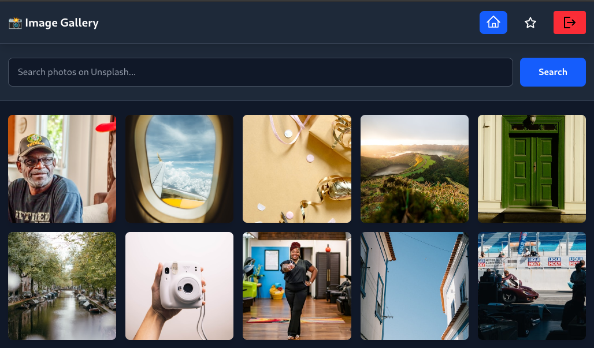

# 📸 Image Gallery

Aplicación web interactiva que permite visualizar y buscar fotografías
de alta calidad utilizando la **API de Unsplash**. Los usuarios pueden
autenticarse mediante **OAuth 2.0** con su cuenta de Unsplash, y una vez
logueados pueden marcar fotos como favoritas.

<p align="center">

</p>

## 🚀 Tecnologías utilizadas

### Frontend

-   React (Functional Components + Hooks)
-   TypeScript
-   TailwindCSS

### Backend

-   Node.js + Express
-   TypeScript
-   Proxies para gestionar OAuth y asegurar credenciales
-   Gestión de sesión mediante tokens en el navegador

### Infraestructura

-   Docker
-   docker-compose

## 📦 Instalación y ejecución

### 1️⃣ Clonar el repositorio

``` bash
bash git clone https://github.com/BishopVK/Piscine-Pedago-Globant
cd Piscine-Pedago-Globant/image-gallery
```

### 2️⃣ Variables de entorno

#### /backend/.env

``` bash
APP_PORT=3000
UNSPLASH_CLIENT_ID=client_id
UNSPLASH_CLIENT_SECRET=client_secret
UNSPLASH_REDIRECT_URI=http://localhost:3000/api/auth/callback
FRONTEND_URL=http://localhost:5173
```

#### /frontend/.env

``` bash
VITE_BACKEND_URL=http://localhost:3000
VITE_UNSPLASH_CLIENT_ID=client_id
VITE_UNSPLASH_CLIENT_SECRET=client_secret
VITE_UNSPLASH_REDIRECT_URI=http://localhost:3000/auth/callback
```

#### .env general

``` bash
UNSPLASH_CLIENT_ID=client_id
UNSPLASH_CLIENT_SECRET=client_secret
```

## ▶️ Ejecución con Docker

``` bash
make
make init
```

## ✨ Funcionalidades implementadas (Parte obligatoria)

-   OAuth 2.0 con Unsplash
-   Mostrar galería de fotos
-   Buscador dinámico
-   Favoritos con persistencia localStorage

## 📁 Estructura del proyecto

``` bash
.
├── backend
│   ├── Dockerfile
│   ├── nodemon.json
│   ├── package.json
│   ├── package-lock.json
│   ├── src
│   │   ├── index.ts
│   │   ├── routes
│   │   │   ├── auth.ts
│   │   │   └── photos.ts
│   │   └── services
│   │       └── unsplash.ts
│   └── tsconfig.json
├── docker-compose.yml
├── docs
│   ├── AppRouter.md
│   ├── FaQ.md
│   ├── initial_config_full_docker.md
│   └── Initial_config.md
├── frontend
│   ├── Dockerfile
│   ├── eslint.config.js
│   ├── index.html
│   ├── package.json
│   ├── package-lock.json
│   ├── public
│   │   └── vite.svg
│   ├── src
│   │   ├── App.css
│   │   ├── App.tsx
│   │   ├── assets
│   │   │   └── react.svg
│   │   ├── components
│   │   │   ├── Navbar.tsx
│   │   │   ├── PhotoCard.tsx
│   │   │   ├── PhotoGrid.tsx
│   │   │   └── PhotoModal.tsx
│   │   ├── context
│   │   │   └── AuthContext.tsx
│   │   ├── index.css
│   │   ├── main.tsx
│   │   ├── pages
│   │   │   ├── Callback.tsx
│   │   │   ├── Favorites.tsx
│   │   │   ├── Home.tsx
│   │   │   └── LoginPage.tsx
│   │   └── services
│   │       └── api.ts
│   ├── tsconfig.app.json
│   ├── tsconfig.json
│   ├── tsconfig.node.json
│   └── vite.config.ts
├── Makefile
├── package.json
├── package-lock.json
└── README.md
```

## 🧪 Cómo probar la aplicación

1.  Ejecutar **make**
2.  Ejecutar **make init** *(la primera vez)*
3.  Abrir http://localhost:5173
4.  Login → OAuth Unsplash
5.  Marcar favoritos

## ✍️ Autor

Daniel Jiménez
